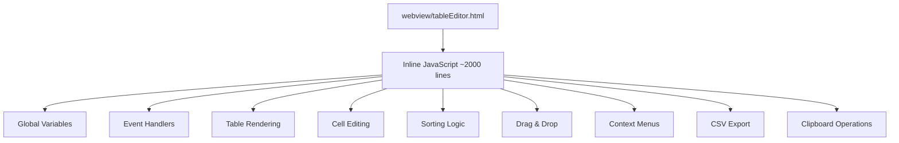
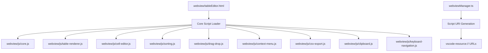

# Design Document

## Overview

VSCode拡張機能「Markdown Table Editor」の`webview/tableEditor.html`ファイル（2400行超）に含まれる大量のJavaScriptコードを機能別に外部ファイルに分割するリファクタリングプロジェクトです。VSCodeのwebviewセキュリティ要件に準拠し、段階的なアプローチで確実に実装します。

## Architecture

### Current Architecture



### Target Architecture



## Components and Interfaces

### 1. Core Module (`webview/js/core.js`)

```javascript
// Global state management and initialization
const TableEditor = {
    // Global state
    state: {
        tableData: null,
        currentEditingCell: null,
        sortState: { column: -1, direction: 'none', isViewOnly: false, originalData: null },
        columnWidths: {},
        displayData: null,
        originalData: null,
        fileInfo: null,
        selectedCells: new Set(),
        selectionStart: null,
        isSelecting: false,
        lastSelectedCell: null
    },
    
    // VSCode API reference
    vscode: null,
    
    // Initialization
    init: function() {
        this.vscode = acquireVsCodeApi();
        this.initializeTableEditor();
    },
    
    // Module registration
    modules: {},
    registerModule: function(name, module) {
        this.modules[name] = module;
        if (module.init) module.init();
    }
};
```

**責任:**
- グローバル状態の管理
- VSCode API の初期化
- モジュール登録システム
- 基本的な初期化処理

### 2. Table Renderer Module (`webview/js/table-renderer.js`)

```javascript
const TableRenderer = {
    // Table rendering functions
    renderTable: function(data) { /* ... */ },
    renderTableContent: function() { /* ... */ },
    getColumnLetter: function(index) { /* ... */ },
    initializeColumnWidths: function(data) { /* ... */ },
    processCellContent: function(cell) { /* ... */ },
    escapeHtml: function(text) { /* ... */ },
    
    init: function() {
        // Initialize renderer
    }
};
```

**責任:**
- テーブルのHTMLレンダリング
- セル内容の処理
- 列幅の管理
- HTML エスケープ処理

### 3. Cell Editor Module (`webview/js/cell-editor.js`)

```javascript
const CellEditor = {
    // Cell editing functions
    startCellEdit: function(row, col) { /* ... */ },
    commitCellEdit: function() { /* ... */ },
    cancelCellEdit: function() { /* ... */ },
    handleCellClick: function(row, col, event) { /* ... */ },
    
    // Enhanced editing features
    determineInputType: function(content) { /* ... */ },
    adjustInputSize: function(input, cell) { /* ... */ },
    autoResizeTextarea: function(textarea) { /* ... */ },
    processCellContentForEditing: function(content) { /* ... */ },
    processCellContentForStorage: function(content) { /* ... */ },
    
    init: function() {
        // Initialize cell editor
    }
};
```

**責任:**
- セル編集機能
- 入力フィールドの管理
- 編集モードの切り替え
- 内容の検証と変換

### 4. Selection Manager Module (`webview/js/selection.js`)

```javascript
const SelectionManager = {
    // Selection functions
    selectCell: function(row, col, event) { /* ... */ },
    selectRange: function(startRow, startCol, endRow, endCol) { /* ... */ },
    selectRow: function(rowIndex, event) { /* ... */ },
    selectColumn: function(colIndex, event) { /* ... */ },
    selectAll: function() { /* ... */ },
    clearSelection: function() { /* ... */ },
    updateCellSelection: function() { /* ... */ },
    
    // Selection state helpers
    isRowFullySelected: function(rowIndex) { /* ... */ },
    isColumnFullySelected: function(colIndex) { /* ... */ },
    
    init: function() {
        // Initialize selection manager
    }
};
```

**責任:**
- セル選択の管理
- 複数選択の処理
- 選択状態の視覚的表示
- 選択範囲の計算

### 5. Sorting Module (`webview/js/sorting.js`)

```javascript
const SortingManager = {
    // Sorting functions
    handleColumnHeaderClick: function(colIndex, event) { /* ... */ },
    applySortView: function(column, direction) { /* ... */ },
    restoreOriginalView: function() { /* ... */ },
    commitSortToFile: function() { /* ... */ },
    updateSortActionsVisibility: function() { /* ... */ },
    
    // Sort utilities
    sortTableData: function(data, column, direction) { /* ... */ },
    
    init: function() {
        // Initialize sorting
    }
};
```

**責任:**
- ソート機能の実装
- ビューオンリーソートの管理
- ソート状態の表示
- ファイルへのソート結果保存

### 6. Drag and Drop Module (`webview/js/drag-drop.js`)

```javascript
const DragDropManager = {
    // Drag and drop functions
    setupDragAndDrop: function() { /* ... */ },
    startRowDrag: function(rowIndex, event) { /* ... */ },
    startColumnDrag: function(colIndex, event) { /* ... */ },
    handleDragOver: function(event) { /* ... */ },
    handleDrop: function(event) { /* ... */ },
    
    // Visual feedback
    showDropIndicator: function(position) { /* ... */ },
    hideDropIndicator: function() { /* ... */ },
    
    init: function() {
        // Initialize drag and drop
    }
};
```

**責任:**
- ドラッグ&ドロップ機能
- 行・列の移動
- ドロップ位置の視覚的フィードバック
- ドラッグ中の状態管理

### 7. Context Menu Module (`webview/js/context-menu.js`)

```javascript
const ContextMenuManager = {
    // Context menu functions
    showRowContextMenu: function(event, rowIndex) { /* ... */ },
    showColumnContextMenu: function(event, colIndex) { /* ... */ },
    hideContextMenus: function() { /* ... */ },
    
    // Context menu actions
    addRowAbove: function() { /* ... */ },
    addRowBelow: function() { /* ... */ },
    deleteRowFromContext: function() { /* ... */ },
    addColumnLeft: function() { /* ... */ },
    addColumnRight: function() { /* ... */ },
    deleteColumnFromContext: function() { /* ... */ },
    
    init: function() {
        // Initialize context menus
        this.setupContextMenuEvents();
    }
};
```

**責任:**
- コンテキストメニューの表示・非表示
- 行・列操作のメニュー項目
- メニューイベントの処理
- メニューの位置計算

### 8. Column Resize Module (`webview/js/column-resize.js`)

```javascript
const ColumnResizeManager = {
    // Column resizing state
    isResizing: false,
    resizeColumn: -1,
    startX: 0,
    startWidth: 0,
    
    // Resize functions
    startColumnResize: function(event, colIndex) { /* ... */ },
    handleColumnResize: function(event) { /* ... */ },
    stopColumnResize: function() { /* ... */ },
    autoFitColumn: function(colIndex) { /* ... */ },
    
    init: function() {
        // Initialize column resize
    }
};
```

**責任:**
- 列幅のリサイズ機能
- オートフィット機能
- リサイズ中の視覚的フィードバック
- 列幅の永続化

### 9. Keyboard Navigation Module (`webview/js/keyboard-navigation.js`)

```javascript
const KeyboardNavigationManager = {
    // Navigation functions
    handleKeyDown: function(event) { /* ... */ },
    navigateCell: function(row, col) { /* ... */ },
    navigateCellSmart: function(row, col, direction) { /* ... */ },
    navigateToNextCell: function(row, col, forward) { /* ... */ },
    
    // Smart navigation helpers
    findNextNonEmptyCell: function(row, col, direction) { /* ... */ },
    findDataBoundary: function(row, col, direction) { /* ... */ },
    
    init: function() {
        // Initialize keyboard navigation
        document.addEventListener('keydown', this.handleKeyDown.bind(this));
    }
};
```

**責任:**
- キーボードナビゲーション
- スマートナビゲーション（Ctrl+矢印キー）
- キーボードショートカット
- セル間の移動ロジック

### 10. Clipboard Manager Module (`webview/js/clipboard.js`)

```javascript
const ClipboardManager = {
    // Clipboard functions
    copySelectedCells: function() { /* ... */ },
    pasteToSelectedCells: function() { /* ... */ },
    cutSelectedCells: function() { /* ... */ },
    
    // Clipboard utilities
    copyToClipboard: function(text) { /* ... */ },
    readFromClipboard: function() { /* ... */ },
    formatCellsForClipboard: function(cells) { /* ... */ },
    processPasteData: function(clipboardText) { /* ... */ },
    
    init: function() {
        // Initialize clipboard manager
    }
};
```

**責任:**
- クリップボード操作
- コピー・ペースト・切り取り機能
- 複数セルの処理
- データ形式の変換

### 11. CSV Export Module (`webview/js/csv-export.js`)

```javascript
const CSVExporter = {
    // CSV export functions
    exportToCSV: function() { /* ... */ },
    generateCSVContent: function(data) { /* ... */ },
    escapeCSVField: function(field) { /* ... */ },
    getDefaultCSVFilename: function() { /* ... */ },
    
    // File download utilities
    downloadFile: function(content, filename, mimeType) { /* ... */ },
    
    init: function() {
        // Initialize CSV exporter
    }
};
```

**責任:**
- CSV形式でのエクスポート
- CSVフィールドのエスケープ処理
- ファイルダウンロード機能
- ファイル名の生成

### 12. Status Bar Manager Module (`webview/js/status-bar.js`)

```javascript
const StatusBarManager = {
    // Status bar functions
    showError: function(message) { /* ... */ },
    showSuccess: function(message) { /* ... */ },
    showInfo: function(message) { /* ... */ },
    hide: function() { /* ... */ },
    
    // Status utilities
    isVisible: function() { /* ... */ },
    updateTableInfo: function() { /* ... */ },
    updateSortStatus: function() { /* ... */ },
    
    init: function() {
        // Initialize status bar
    }
};
```

**責任:**
- ステータスバーの管理
- エラー・成功メッセージの表示
- テーブル情報の表示
- メッセージの自動非表示

## Data Models

### Module Interface

```javascript
interface TableEditorModule {
    init(): void;
    destroy?(): void;
}
```

### Global State Structure

```javascript
interface TableEditorState {
    tableData: TableData | null;
    currentEditingCell: { row: number; col: number } | null;
    sortState: SortState;
    columnWidths: { [key: number]: number };
    displayData: TableData | null;
    originalData: TableData | null;
    fileInfo: FileInfo | null;
    selectedCells: Set<string>;
    selectionStart: { row: number; col: number } | null;
    isSelecting: boolean;
    lastSelectedCell: { row: number; col: number } | null;
}
```

## Security Implementation

### VSCode Resource Loading

```javascript
// In webviewManager.ts
private getWebviewContent(): string {
    const htmlPath = path.join(this.context.extensionPath, 'webview', 'tableEditor.html');
    let html = fs.readFileSync(htmlPath, 'utf8');
    
    // Generate script URIs
    const scriptFiles = [
        'js/core.js',
        'js/table-renderer.js',
        'js/cell-editor.js',
        'js/selection.js',
        'js/sorting.js',
        'js/drag-drop.js',
        'js/context-menu.js',
        'js/column-resize.js',
        'js/keyboard-navigation.js',
        'js/clipboard.js',
        'js/csv-export.js',
        'js/status-bar.js'
    ];
    
    const scriptUris = scriptFiles.map(file => {
        const scriptPath = vscode.Uri.joinPath(this.context.extensionUri, 'webview', file);
        return panel.webview.asWebviewUri(scriptPath);
    });
    
    // Inject script URIs into HTML
    const scriptTags = scriptUris.map(uri => `<script src="${uri}"></script>`).join('\n');
    html = html.replace('</body>', `${scriptTags}\n</body>`);
    
    return html;
}
```

### Content Security Policy

```html
<meta http-equiv="Content-Security-Policy" 
      content="default-src 'none'; 
               style-src 'unsafe-inline' vscode-resource: https:; 
               style-src-elem 'self' vscode-resource: https:; 
               script-src vscode-resource:;">
```

## Error Handling

### Module Loading Error Handling

```javascript
// In core.js
const TableEditor = {
    loadModule: function(name, scriptUri) {
        return new Promise((resolve, reject) => {
            const script = document.createElement('script');
            script.src = scriptUri;
            script.onload = () => {
                if (window[name]) {
                    this.registerModule(name, window[name]);
                    resolve();
                } else {
                    reject(new Error(`Module ${name} not found after loading`));
                }
            };
            script.onerror = () => reject(new Error(`Failed to load ${name}`));
            document.head.appendChild(script);
        });
    },
    
    handleModuleError: function(moduleName, error) {
        console.error(`Error in module ${moduleName}:`, error);
        this.showFallbackUI(`Module ${moduleName} failed to load. Some features may not work.`);
    }
};
```

### Fallback Mechanisms

```javascript
// Graceful degradation for missing modules
const SafeModuleCall = {
    call: function(moduleName, methodName, ...args) {
        try {
            const module = TableEditor.modules[moduleName];
            if (module && module[methodName]) {
                return module[methodName](...args);
            } else {
                console.warn(`Module ${moduleName} or method ${methodName} not available`);
                return null;
            }
        } catch (error) {
            console.error(`Error calling ${moduleName}.${methodName}:`, error);
            return null;
        }
    }
};
```

## Testing Strategy

### Module Testing

```javascript
// Test each module independently
describe('TableRenderer', () => {
    beforeEach(() => {
        // Setup mock DOM and TableEditor state
    });
    
    it('should render table correctly', () => {
        // Test table rendering
    });
});
```

### Integration Testing

```javascript
// Test module interactions
describe('Module Integration', () => {
    it('should handle cell editing with selection', () => {
        // Test CellEditor + SelectionManager interaction
    });
});
```

### End-to-End Testing

```javascript
// Test complete workflows
describe('Complete Workflows', () => {
    it('should complete full editing workflow', () => {
        // Test from cell selection to save
    });
});
```

## Implementation Phases

### Phase 1: Core Infrastructure
1. Create `webview/js/` directory
2. Implement `core.js` with module system
3. Update `webviewManager.ts` for script loading
4. Test basic module loading

### Phase 2: Table Rendering
1. Extract table rendering code to `table-renderer.js`
2. Update HTML to use modular rendering
3. Test table display functionality

### Phase 3: Cell Editing
1. Extract cell editing code to `cell-editor.js`
2. Extract selection code to `selection.js`
3. Test editing and selection functionality

### Phase 4: Advanced Features
1. Extract sorting to `sorting.js`
2. Extract drag-drop to `drag-drop.js`
3. Extract context menu to `context-menu.js`
4. Test advanced features

### Phase 5: Utilities
1. Extract column resize to `column-resize.js`
2. Extract keyboard navigation to `keyboard-navigation.js`
3. Extract clipboard to `clipboard.js`
4. Extract CSV export to `csv-export.js`
5. Extract status bar to `status-bar.js`

### Phase 6: Final Integration
1. Complete integration testing
2. Performance optimization
3. Documentation updates
4. Final validation

## Performance Considerations

### Script Loading Optimization
- Scripts loaded in dependency order
- Minimal global namespace pollution
- Lazy loading for non-critical features

### Memory Management
- Proper event listener cleanup
- Module destruction methods
- Avoid memory leaks in closures

### Caching Strategy
- Browser caching for script files
- Efficient DOM manipulation
- Minimize re-rendering

## Migration Benefits

1. **Maintainability**: Smaller, focused files are easier to maintain
2. **Testability**: Individual modules can be tested in isolation
3. **Reusability**: Modules can be reused or replaced independently
4. **Debugging**: Easier to locate and fix issues
5. **Performance**: Better caching and loading strategies
6. **Security**: Proper VSCode webview security compliance
7. **Scalability**: Easier to add new features without affecting existing code