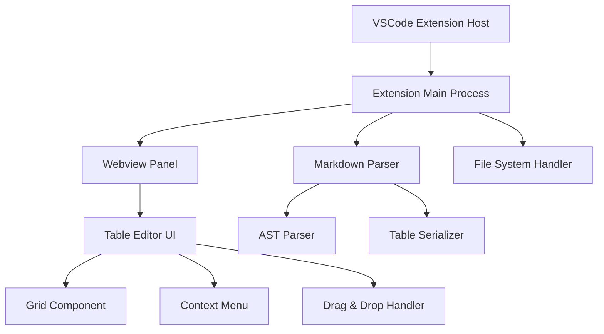

# Design Document

## Overview

VSCode拡張機能「Markdown Table Editor」は、Markdownファイル内のテーブルをSpreadsheetライクなUIで編集できる機能を提供します。この拡張機能は、VSCodeのWebview APIを使用してカスタムエディタを実装し、Markdownファイルの解析・更新を行います。

## Architecture

### High-Level Architecture



### Component Architecture

1. **Extension Host Layer**
   - VSCode拡張機能のエントリーポイント
   - コマンドの登録とイベントハンドリング

2. **Core Logic Layer**
   - Markdownファイルの解析と更新
   - テーブルデータの管理

3. **UI Layer**
   - Webviewベースのテーブルエディタ
   - Spreadsheetライクなインタラクション

## Components and Interfaces

### 1. Extension Main (`extension.ts`)

```typescript
interface ExtensionContext {
  activate(context: vscode.ExtensionContext): void;
  deactivate(): void;
}

interface CommandHandler {
  openTableEditor(uri: vscode.Uri, position?: vscode.Position): void;
  createNewTable(uri: vscode.Uri, position: vscode.Position): void;
}
```

**責任:**
- 拡張機能の初期化
- コマンドとコンテキストメニューの登録
- Webviewパネルの管理

### 2. Markdown Parser (`markdownParser.ts`)

```typescript
interface MarkdownParser {
  parseDocument(content: string): MarkdownAST;
  findTablesInDocument(ast: MarkdownAST): TableNode[];
  findTableAtPosition(ast: MarkdownAST, position: Position): TableNode | null;
}

interface TableNode {
  startLine: number;
  endLine: number;
  headers: string[];
  rows: string[][];
  alignment: ('left' | 'center' | 'right')[];
}
```

**責任:**
- Markdownファイルの構文解析
- テーブル要素の抽出と位置特定
- ASTからテーブルデータへの変換

### 3. Table Data Manager (`tableDataManager.ts`)

```typescript
interface TableDataManager {
  loadTable(tableNode: TableNode): TableData;
  updateCell(row: number, col: number, value: string): void;
  addRow(index?: number): void;
  deleteRow(index: number): void;
  addColumn(index?: number, header?: string): void;
  deleteColumn(index: number): void;
  sortByColumn(columnIndex: number, direction: 'asc' | 'desc'): void;
  moveRow(fromIndex: number, toIndex: number): void;
  moveColumn(fromIndex: number, toIndex: number): void;
  serializeToMarkdown(): string;
}

interface TableData {
  headers: string[];
  rows: string[][];
  alignment: ('left' | 'center' | 'right')[];
}
```

**責任:**
- テーブルデータの状態管理
- CRUD操作の実装
- ソートと並び替え機能
- Markdown形式への変換

### 4. Webview Panel Manager (`webviewManager.ts`)

```typescript
interface WebviewManager {
  createTableEditorPanel(tableData: TableData, uri: vscode.Uri): vscode.WebviewPanel;
  updateTableData(panel: vscode.WebviewPanel, tableData: TableData): void;
  handleMessage(message: WebviewMessage): void;
}

interface WebviewMessage {
  command: 'updateCell' | 'addRow' | 'deleteRow' | 'addColumn' | 'deleteColumn' | 'sort' | 'move';
  data: any;
}
```

**責任:**
- Webviewパネルの作成と管理
- UIとの双方向通信
- メッセージハンドリング

### 5. Table Editor UI (`webview/tableEditor.html` + `webview/tableEditor.js`)

```typescript
interface TableEditorUI {
  renderTable(tableData: TableData): void;
  enableCellEditing(): void;
  setupDragAndDrop(): void;
  setupSorting(): void;
  setupContextMenu(): void;
}

interface CellEditor {
  startEdit(cell: HTMLElement): void;
  commitEdit(): void;
  cancelEdit(): void;
}
```

**責任:**
- テーブルのレンダリング
- セル編集機能
- ドラッグ&ドロップ操作
- ソート機能のUI
- コンテキストメニュー

### 6. File System Handler (`fileHandler.ts`)

```typescript
interface FileHandler {
  readMarkdownFile(uri: vscode.Uri): Promise<string>;
  writeMarkdownFile(uri: vscode.Uri, content: string): Promise<void>;
  updateTableInFile(uri: vscode.Uri, tableNode: TableNode, newContent: string): Promise<void>;
}
```

**責任:**
- ファイルの読み書き
- テーブル部分の置換
- ファイル変更の通知

## Data Models

### TableData Model

```typescript
interface TableData {
  id: string;
  headers: string[];
  rows: string[][];
  alignment: ColumnAlignment[];
  metadata: TableMetadata;
}

interface ColumnAlignment {
  type: 'left' | 'center' | 'right';
}

interface TableMetadata {
  sourceUri: string;
  startLine: number;
  endLine: number;
  lastModified: Date;
}
```

### WebviewMessage Model

```typescript
type WebviewMessage = 
  | { command: 'updateCell'; data: { row: number; col: number; value: string } }
  | { command: 'addRow'; data: { index?: number } }
  | { command: 'deleteRow'; data: { index: number } }
  | { command: 'addColumn'; data: { index?: number; header?: string } }
  | { command: 'deleteColumn'; data: { index: number } }
  | { command: 'sort'; data: { column: number; direction: 'asc' | 'desc' } }
  | { command: 'moveRow'; data: { from: number; to: number } }
  | { command: 'moveColumn'; data: { from: number; to: number } };
```

## Error Handling

### 1. File System Errors

- **ファイル読み込みエラー**: ユーザーに通知し、再試行オプションを提供
- **ファイル書き込みエラー**: 変更を一時保存し、手動保存を促す
- **権限エラー**: 適切なエラーメッセージを表示

### 2. Parsing Errors

- **不正なMarkdown**: エラー位置を特定し、修正提案を表示
- **テーブル構造エラー**: 自動修正機能を提供
- **文字エンコーディングエラー**: UTF-8での再読み込みを試行

### 3. UI Errors

- **Webview通信エラー**: 接続の再確立を試行
- **レンダリングエラー**: フォールバック表示を提供
- **操作競合**: 楽観的ロックによる競合解決

### Error Recovery Strategy

```typescript
interface ErrorHandler {
  handleFileSystemError(error: FileSystemError): Promise<void>;
  handleParsingError(error: ParsingError): Promise<void>;
  handleUIError(error: UIError): Promise<void>;
  showErrorNotification(message: string, actions?: string[]): void;
}
```

## Testing Strategy

### 1. Unit Tests

- **Markdown Parser**: 各種テーブル形式の解析テスト
- **Table Data Manager**: CRUD操作とデータ変換のテスト
- **File Handler**: ファイル操作のモックテスト

### 2. Integration Tests

- **Extension Activation**: 拡張機能の初期化テスト
- **Webview Communication**: メッセージ送受信のテスト
- **File System Integration**: 実際のファイル操作テスト

### 3. E2E Tests

- **Table Editing Workflow**: 完全な編集フローのテスト
- **Multiple Files**: 複数ファイル同時編集のテスト
- **Error Scenarios**: エラー処理のテスト

### Test Structure

```typescript
// Unit Test Example
describe('TableDataManager', () => {
  describe('updateCell', () => {
    it('should update cell value correctly', () => {
      // テスト実装
    });
  });
});

// Integration Test Example
describe('Extension Integration', () => {
  it('should open table editor from context menu', async () => {
    // テスト実装
  });
});
```

### Test Data

- **Sample Markdown Files**: 様々なテーブル形式のサンプル
- **Edge Cases**: 空のテーブル、不正な形式、特殊文字
- **Performance Tests**: 大きなテーブルでの性能テスト

## Implementation Notes

### VSCode Extension Structure

```
markdown-table-editor/
├── package.json
├── src/
│   ├── extension.ts
│   ├── markdownParser.ts
│   ├── tableDataManager.ts
│   ├── webviewManager.ts
│   └── fileHandler.ts
├── webview/
│   ├── tableEditor.html
│   ├── tableEditor.js
│   └── tableEditor.css
└── test/
    ├── unit/
    └── integration/
```

### Key Dependencies

- **@types/vscode**: VSCode API型定義
- **markdown-it**: Markdown解析
- **sortablejs**: ドラッグ&ドロップ機能
- **mocha**: テストフレームワーク

### Performance Considerations

- **Large Tables**: 仮想スクロールによる最適化
- **File Watching**: 効率的なファイル変更監視
- **Memory Management**: Webviewの適切な破棄