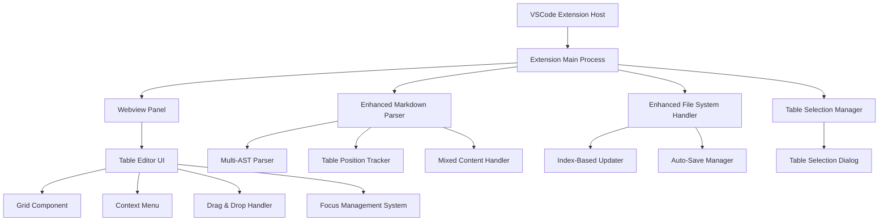
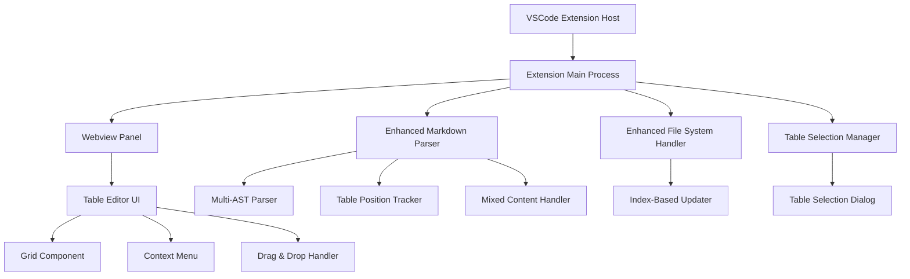

# Design Document

## Overview

VSCode拡張機能「Markdown Table Editor」は、Markdownファイル内のテーブルをSpreadsheetライクなUIで編集できる機能を提供します。この拡張機能は、VSCodeのWebview APIを使用してカスタムエディタを実装し、Markdownファイルの解析・更新を行います。

## Key Features (v0.1.21)

- **Excel-like Interface**: Excel風のグリッドエディタでテーブル編集
- **Advanced Copy/Paste Operations**: Ctrl+C/V/X for clipboard operations with multi-cell support
- **Smart Navigation**: Ctrl+Arrow keys for intelligent data boundary navigation
- **IME Support**: Full Japanese and multi-language input method compatibility
- **Column Width Management**: Auto-fit functionality with double-click resize handles
- **CSV Export**: One-click export to CSV format with proper field escaping
- **Data Synchronization**: Real-time sync between VSCode editor and Table Editor
- **Enhanced Cell Editing**: Adaptive text input with automatic single-line/multi-line detection
- **HTML Break Tag Support**: Automatic conversion of `<br/>` tags to line breaks
- **View-Only Sorting**: Safe sorting with explicit save option
- **Multi-Table Support**: Robust handling of multiple tables in single document
- **Mixed Content Compatibility**: Safe editing in documents with code blocks, lists, etc.
- **Enhanced UI/UX**: Clean interface with seamless save status transitions

## Architecture

### High-Level Architecture



### Component Architecture

1. **Extension Host Layer**
   - VSCode拡張機能のエントリーポイント
   - コマンドの登録とイベントハンドリング

2. **Core Logic Layer**
   - Markdownファイルの解析と更新
   - テーブルデータの管理

3. **UI Layer**
   - Webviewベースのテーブルエディタ
   - Spreadsheetライクなインタラクション
   - 改善されたUI/UX（ステータスバー、簡素化されたツールバー）

4. **Enhanced UI/UX Layer (v0.1.10)**
   - 下部ステータスバーでのメッセージ表示
   - 分離された行列操作（移動 vs リサイズ）
   - 適応的セル編集（セルサイズ対応、multi-line自動判定）
   - HTMLタグサポート（`<br/>`タグの改行変換、編集時・表示時の双方向変換）
   - 改善された編集フォーカス管理（入力フィールドクリック継続）
   - 精密なイベントハンドリング
   - ビューオンリーソート機能とファイル保護

## Components and Interfaces

### 1. Extension Main (`extension.ts`)

```typescript
interface ExtensionContext {
  activate(context: vscode.ExtensionContext): void;
  deactivate(): void;
}

interface CommandHandler {
  openTableEditor(uri: vscode.Uri, position?: vscode.Position): void;
  createNewTable(uri: vscode.Uri, position: vscode.Position): void;
}
```

**責任:**
- 拡張機能の初期化
- コマンドとコンテキストメニューの登録
- Webviewパネルの管理

### 2. Enhanced Extension Main (`extension.ts`)

```typescript
interface EnhancedCommandHandler {
  openTableEditor(uri: vscode.Uri, position?: vscode.Position): void;
  createNewTable(uri: vscode.Uri, position: vscode.Position): void;
  showTableSelectionDialog(tables: TableNode[]): Promise<TableNode | null>;
}

interface TableSelectionItem {
  label: string;
  description: string;
  detail: string;
  table: TableNode;
  index: number;
}
```

### 3. Markdown Parser (`markdownParser.ts`)

```typescript
interface MarkdownParser {
  parseDocument(content: string): MarkdownAST;
  findTablesInDocument(ast: MarkdownAST): TableNode[];
  findTableAtPosition(ast: MarkdownAST, position: Position): TableNode | null;
}

interface TableNode {
  startLine: number;
  endLine: number;
  headers: string[];
  rows: string[][];
  alignment: ('left' | 'center' | 'right')[];
}
```

**責任:**
- Markdownファイルの構文解析
- テーブル要素の抽出と位置特定
- ASTからテーブルデータへの変換

### 4. Enhanced Markdown Parser (`markdownParser.ts`)

```typescript
interface EnhancedMarkdownParser {
  parseDocument(content: string): MarkdownAST;
  findTablesInDocument(ast: MarkdownAST): TableNode[];
  findTableAtPosition(ast: MarkdownAST, position: Position): TableNode | null;
  extractTablePositionsFromTokens(tokens: any[], content: string): TablePosition[];
  validateMixedContent(content: string): ValidationResult;
}

interface TablePosition {
  startLine: number;
  endLine: number;
  tableIndex: number;
}

interface ValidationResult {
  isValid: boolean;
  tables: number;
  codeBlocks: number;
  issues: string[];
}
```

### 5. Table Data Manager (`tableDataManager.ts`)

```typescript
interface TableDataManager {
  loadTable(tableNode: TableNode): TableData;
  updateCell(row: number, col: number, value: string): void;
  addRow(index?: number): void;
  deleteRow(index: number): void;
  addColumn(index?: number, header?: string): void;
  deleteColumn(index: number): void;
  sortByColumn(columnIndex: number, direction: 'asc' | 'desc'): void;
  moveRow(fromIndex: number, toIndex: number): void;
  moveColumn(fromIndex: number, toIndex: number): void;
  serializeToMarkdown(): string;
}

interface TableData {
  headers: string[];
  rows: string[][];
  alignment: ('left' | 'center' | 'right')[];
}
```

**責任:**
- テーブルデータの状態管理
- CRUD操作の実装
- ソートと並び替え機能
- Markdown形式への変換

### 6. Enhanced Table Data Manager (`tableDataManager.ts`)

```typescript
interface EnhancedTableDataManager {
  constructor(tableNode: TableNode, sourceUri: string, tableIndex: number);
  loadTable(tableNode: TableNode, sourceUri: string, tableIndex: number): TableData;
  getTableIndex(): number;
  updateCell(row: number, col: number, value: string): void;
  // ... existing methods ...
}

interface EnhancedTableData {
  id: string;
  headers: string[];
  rows: string[][];
  alignment: ('left' | 'center' | 'right')[];
  metadata: EnhancedTableMetadata;
}

interface EnhancedTableMetadata {
  sourceUri: string;
  startLine: number;
  endLine: number;
  tableIndex: number;  // New: Index of table in document
  lastModified: Date;
  columnCount: number;
  rowCount: number;
  isValid: boolean;
  validationIssues: string[];
}
```

### 7. Webview Panel Manager (`webviewManager.ts`)

```typescript
interface WebviewManager {
  createTableEditorPanel(tableData: TableData, uri: vscode.Uri): vscode.WebviewPanel;
  updateTableData(panel: vscode.WebviewPanel, tableData: TableData): void;
  handleMessage(message: WebviewMessage): void;
}

interface WebviewMessage {
  command: 'updateCell' | 'addRow' | 'deleteRow' | 'addColumn' | 'deleteColumn' | 'sort' | 'move';
  data: any;
}
```

**責任:**
- Webviewパネルの作成と管理
- UIとの双方向通信
- メッセージハンドリング

### 8. Enhanced Table Editor UI (`webview/tableEditor.html` + `webview/tableEditor.js`)

```typescript
interface EnhancedTableEditorUI {
  renderTable(tableData: TableData): void;
  enableCellEditing(): void;
  setupDragAndDrop(): void;
  setupSorting(): void;
  setupContextMenu(): void;
  // Enhanced UI/UX features (v0.1.6)
  setupStatusBar(): void;
  showStatusMessage(message: string, type: 'error' | 'success'): void;
  hideStatusMessage(): void;
  handleSmartFocus(): void;
}

interface EnhancedCellEditor {
  startEdit(cell: HTMLElement): void;
  commitEdit(): void;
  cancelEdit(): void;
  // Enhanced editing features
  handleFocusLoss(): void;
  preventEventPropagation(): void;
  // Adaptive input features (v0.1.9)
  determineInputType(content: string): 'single-line' | 'multi-line';
  adjustInputSize(input: HTMLElement, cell: HTMLElement): void;
  autoResizeTextarea(textarea: HTMLTextAreaElement): void;
  // HTML tag processing features (v0.1.10)
  processCellContent(content: string): string;
  processCellContentForEditing(content: string): string;
  processCellContentForStorage(content: string): string;
  // Excel-like operations (v0.1.21)
  copySelectedCells(): void;
  pasteToSelectedCells(): void;
  cutSelectedCells(): void;
  processPasteData(clipboardText: string): void;
}

interface ClipboardManager {
  copyToClipboard(text: string): Promise<void>;
  readFromClipboard(): Promise<string>;
  fallbackCopyToClipboard(text: string): void;
  formatCellsForClipboard(cells: Array<{row: number, col: number, value: string}>): string;
}

interface CSVExporter {
  exportToCSV(): void;
  generateCSVContent(data: TableData): string;
  escapeCSVField(field: string): string;
  getDefaultCSVFilename(): string;
}

interface StatusBarManager {
  showError(message: string): void;
  showSuccess(message: string): void;
  hide(): void;
  isVisible(): boolean;
}
```

**責任:**
- テーブルのレンダリング
- セル編集機能（改善されたフォーカス管理）
- ドラッグ&ドロップ操作
- ソート機能のUI
- コンテキストメニュー
- ステータスバーでのメッセージ表示（v0.1.6）
- 簡素化されたツールバー（v0.1.6）

### 9. File System Handler (`fileHandler.ts`)

```typescript
interface FileHandler {
  readMarkdownFile(uri: vscode.Uri): Promise<string>;
  writeMarkdownFile(uri: vscode.Uri, content: string): Promise<void>;
  updateTableInFile(uri: vscode.Uri, tableNode: TableNode, newContent: string): Promise<void>;
}
```

**責任:**
- ファイルの読み書き
- テーブル部分の置換
- ファイル変更の通知

### 10. Enhanced File Handler (`fileHandler.ts`)

```typescript
interface EnhancedFileHandler {
  readMarkdownFile(uri: vscode.Uri): Promise<string>;
  writeMarkdownFile(uri: vscode.Uri, content: string): Promise<void>;
  updateTableInFile(uri: vscode.Uri, startLine: number, endLine: number, newTableContent: string): Promise<void>;
  updateTableByIndex(uri: vscode.Uri, tableIndex: number, newTableContent: string): Promise<void>;  // New
  updateMultipleTablesInFile(uri: vscode.Uri, updates: TableUpdate[]): Promise<void>;
  extractTablePositionsFromTokens(tokens: any[], content: string): TablePosition[];  // New
}

interface TableUpdate {
  tableIndex: number;
  startLine: number;
  endLine: number;
  newContent: string;
}
```

### 11. Table Selection Manager (New Component)

```typescript
interface TableSelectionManager {
  showSelectionDialog(tables: TableNode[]): Promise<TableSelectionResult>;
  formatTablePreview(table: TableNode): string;
  createSelectionItems(tables: TableNode[]): TableSelectionItem[];
}

interface TableSelectionResult {
  selectedTable: TableNode;
  selectedIndex: number;
  cancelled: boolean;
}
```

## Data Models

### TableData Model

```typescript
interface TableData {
  id: string;
  headers: string[];
  rows: string[][];
  alignment: ColumnAlignment[];
  metadata: TableMetadata;
}

interface ColumnAlignment {
  type: 'left' | 'center' | 'right';
}

interface TableMetadata {
  sourceUri: string;
  startLine: number;
  endLine: number;
  lastModified: Date;
}
```

### WebviewMessage Model

```typescript
type WebviewMessage = 
  | { command: 'updateCell'; data: { row: number; col: number; value: string } }
  | { command: 'addRow'; data: { index?: number } }
  | { command: 'deleteRow'; data: { index: number } }
  | { command: 'addColumn'; data: { index?: number; header?: string } }
  | { command: 'deleteColumn'; data: { index: number } }
  | { command: 'sort'; data: { column: number; direction: 'asc' | 'desc' } }
  | { command: 'moveRow'; data: { from: number; to: number } }
  | { command: 'moveColumn'; data: { from: number; to: number } };
```

## Error Handling

### 1. File System Errors

- **ファイル読み込みエラー**: ユーザーに通知し、再試行オプションを提供
- **ファイル書き込みエラー**: 変更を一時保存し、手動保存を促す
- **権限エラー**: 適切なエラーメッセージを表示

### 2. Parsing Errors

- **不正なMarkdown**: エラー位置を特定し、修正提案を表示
- **テーブル構造エラー**: 自動修正機能を提供
- **文字エンコーディングエラー**: UTF-8での再読み込みを試行

### 3. UI Errors

- **Webview通信エラー**: 接続の再確立を試行
- **レンダリングエラー**: フォールバック表示を提供
- **操作競合**: 楽観的ロックによる競合解決

### Error Recovery Strategy

```typescript
interface ErrorHandler {
  handleFileSystemError(error: FileSystemError): Promise<void>;
  handleParsingError(error: ParsingError): Promise<void>;
  handleUIError(error: UIError): Promise<void>;
  showErrorNotification(message: string, actions?: string[]): void;
}
```

## Testing Strategy

### 1. Unit Tests

- **Markdown Parser**: 各種テーブル形式の解析テスト
- **Table Data Manager**: CRUD操作とデータ変換のテスト
- **File Handler**: ファイル操作のモックテスト

### 2. Integration Tests

- **Extension Activation**: 拡張機能の初期化テスト
- **Webview Communication**: メッセージ送受信のテスト
- **File System Integration**: 実際のファイル操作テスト

### 3. E2E Tests

- **Table Editing Workflow**: 完全な編集フローのテスト
- **Multiple Files**: 複数ファイル同時編集のテスト
- **Error Scenarios**: エラー処理のテスト

### Test Structure

```typescript
// Unit Test Example
describe('TableDataManager', () => {
  describe('updateCell', () => {
    it('should update cell value correctly', () => {
      // テスト実装
    });
  });
});

// Integration Test Example
describe('Extension Integration', () => {
  it('should open table editor from context menu', async () => {
    // テスト実装
  });
});
```

### Test Data

- **Sample Markdown Files**: 様々なテーブル形式のサンプル
- **Edge Cases**: 空のテーブル、不正な形式、特殊文字
- **Performance Tests**: 大きなテーブルでの性能テスト

## Implementation Notes

### VSCode Extension Structure

```
markdown-table-editor/
├── package.json
├── src/
│   ├── extension.ts
│   ├── markdownParser.ts
│   ├── tableDataManager.ts
│   ├── webviewManager.ts
│   └── fileHandler.ts
├── webview/
│   ├── tableEditor.html
│   ├── tableEditor.js
│   └── tableEditor.css
└── test/
    ├── unit/
    └── integration/
```

### Key Dependencies

- **@types/vscode**: VSCode API型定義
- **markdown-it**: Markdown解析
- **sortablejs**: ドラッグ&ドロップ機能
- **mocha**: テストフレームワーク

### Performance Considerations

- **Large Tables**: 仮想スクロールによる最適化
- **File Watching**: 効率的なファイル変更監視
- **Memory Management**: Webviewの適切な破棄

## Multi-Table Support

### Enhanced Architecture for Multi-Table Support



### Multi-Table Architecture Features

1. **Table Index Tracking**
   - Each table is assigned a unique index within the document
   - TableDataManager maintains `tableIndex` for precise identification
   - FileHandler uses `updateTableByIndex()` for accurate updates

2. **Mixed Content Support**
   - Advanced AST parsing distinguishes between actual tables and table-like content in code blocks
   - Preserves all non-table content during updates
   - Accurate line range calculation prevents corruption

3. **Enhanced Error Handling**
   - Comprehensive validation with detailed error messages
   - Recovery options for failed operations

4. **Table Selection UI**
   - QuickPick dialog for multi-table scenarios
   - Shows table location, headers, size, and content preview
   - Intuitive table identification for users

## Data Flow for Multi-Table Operations

1. **Table Selection Flow:**
   ```
   User triggers "Open Table Editor" 
   → Parse document and find all tables
   → If multiple tables: show selection dialog
   → User selects table → Create TableDataManager with tableIndex
   → Open editor for selected table
   ```

2. **Table Update Flow:**
   ```
   User modifies table in editor
   → TableDataManager updates internal data
   → Extension calls FileHandler.updateTableByIndex()
   → FileHandler re-parses document to get current positions
   → Updates only the specified table by index
   → Preserves all other content
   ```

3. **Error Recovery Flow:**
   ```
   Error occurs during update
   → Show detailed error message to user
   → Log error details for debugging
   → Provide alternative save options
   ```

## Implementation Benefits

1. **Accuracy**: Index-based tracking prevents table mix-ups
2. **Robustness**: Handles complex document structures gracefully
3. **User Experience**: Intuitive table selection for multi-table documents
5. **Maintainability**: Clear separation of concerns and error handling
6. **Enhanced UI/UX (v0.1.6)**: Improved user interface with better usability

## UI/UX Enhancements (v0.1.6)

### Status Bar and Message System

- **Bottom Status Bar**: Error and save messages displayed at the bottom for non-intrusive feedback
- **VSCode Theme Integration**: All messages use proper VSCode theme colors and styling
- **Auto-Hide Messages**: Temporary display with automatic hiding after a few seconds
- **Message Types**: Support for error, success, and informational messages

### Simplified Interface

- **Toolbar Simplification**: Removed Save, Export, Delete Row, and Delete Column buttons
- **Context Menu Focus**: All operations accessible through right-click context menus
- **Clean Workspace**: Minimized UI clutter for better focus on table content
- **Streamlined Commands**: Removed "Create New Table" command for focused editing experience

### Enhanced Editing Experience

- **Smart Focus Management**: Editing automatically commits when selecting another cell
- **Improved Input Handling**: Text input boxes properly handle clicks and prevent focus issues
- **Event Propagation Control**: Better handling of keyboard and mouse events during editing
- **Seamless Navigation**: Enhanced keyboard navigation and cell selection behavior

### Technical Implementation

```typescript
// Status Bar Message System
interface StatusBarMessage {
  type: 'error' | 'success' | 'info';
  message: string;
  duration: number;
  autoHide: boolean;
}

// Enhanced Cell Editor
interface EnhancedCellEditor {
  handleFocusLoss(): void;
  preventEventPropagation(event: Event): void;
  commitOnCellChange(): void;
}

// UI State Management
interface UIState {
  isEditing: boolean;
  activeCell: { row: number; col: number } | null;
  statusMessage: StatusBarMessage | null;
  toolbarVisible: boolean;
}
```

### User Experience Improvements

1. **Non-intrusive Feedback**: Status messages don't interfere with editing workflow
2. **Intuitive Operations**: Right-click context menus provide discoverability
3. **Focus Management**: Smart editing behavior prevents data loss
4. **Visual Clarity**: Clean interface promotes concentration on content
5. **Responsive Design**: Improved interaction patterns for better usability
6. **Adaptive Cell Editing (v0.1.9)**: Input fields automatically adjust to cell size and content type
7. **Natural Multi-line Support**: Seamless transition between single-line and multi-line editing
8. **HTML Tag Support (v0.1.10)**: Automatic conversion of `<br/>` tags to line breaks for natural editing

## Sort Functionality Enhancement (v0.1.8)

### Current Sort Implementation Issues

- **File Modification**: Current implementation saves sort changes directly to the Markdown file
- **Unwanted Persistence**: Users may want temporary sorting for viewing without affecting the original file
- **Data Integrity**: Accidental sorting can modify the intended order of the original data

### Enhanced Sort Design

#### Core Concept: View-Only Sorting

```typescript
interface SortState {
  column: number;
  direction: 'asc' | 'desc' | 'none';
  isViewOnly: boolean;  // New: Indicates if sort is temporary
  originalData: TableData | null;  // New: Stores original table state
}

interface SortManager {
  applySortView(column: number, direction: 'asc' | 'desc'): void;
  restoreOriginalView(): void;
  commitSortToFile(): void;  // Optional: Allow explicit saving
  isTemporarySort(): boolean;
}
```

#### Implementation Strategy

1. **Dual Data Model**
   ```typescript
   interface TableEditorState {
     originalData: TableData;     // Original file data (never modified by sort)
     displayData: TableData;      // Data shown in UI (can be sorted)
     sortState: SortState;        // Current sort configuration
   }
   ```

2. **Sort Operations**
   ```typescript
   // View-only sort (default behavior)
   function applySortView(column: number, direction: 'asc' | 'desc'): void {
     // Store original data if not already stored
     if (!sortState.originalData) {
       sortState.originalData = cloneDeep(tableData);
     }
     
     // Apply sort to display data only
     displayData = sortTableData(displayData, column, direction);
     sortState.column = column;
     sortState.direction = direction;
     sortState.isViewOnly = true;
     
     // Update UI with sorted data
     renderTable(displayData);
     updateSortIndicators();
   }

   // Restore original order
   function restoreOriginalView(): void {
     if (sortState.originalData) {
       displayData = cloneDeep(sortState.originalData);
       sortState = { column: -1, direction: 'none', isViewOnly: false, originalData: null };
       renderTable(displayData);
     }
   }

   // Optional: Commit sort to file
   function commitSortToFile(): void {
     if (sortState.isViewOnly && sortState.originalData) {
       // Send sorted data to extension for file update
       vscode.postMessage({
         command: 'commitSort',
         data: { sortedData: displayData }
       });
       
       // Update original data to sorted state
       sortState.originalData = null;
       sortState.isViewOnly = false;
     }
   }
   ```

3. **UI Enhancements**
   ```typescript
   interface SortUI {
     showSortIndicator(column: number, direction: 'asc' | 'desc'): void;
     showTemporarySortBadge(): void;  // Visual indicator for temporary sort
     showSortActions(): void;         // Restore/Commit buttons
   }
   ```

#### User Interface Design

1. **Sort Indicators**
   - Visual arrows in column headers (▲/▼)
   - Distinct styling for temporary vs committed sorts
   - Badge or icon indicating "view-only" sort state

2. **Sort Controls**
   ```html
   <!-- Sort actions when temporary sort is active -->
   <div class="sort-actions" style="display: none;">
     <button onclick="restoreOriginalView()">📄 Restore Original</button>
     <button onclick="commitSortToFile()">💾 Save Sort to File</button>
   </div>
   ```

3. **Status Bar Integration**
   ```typescript
   function updateSortStatus(): void {
     if (sortState.isViewOnly) {
       showStatus(`Viewing sorted by ${getColumnLetter(sortState.column)} (${sortState.direction}) - Original order preserved`);
     }
   }
   ```

#### Implementation Benefits

1. **Data Safety**: Original file data is never accidentally modified by sorting
2. **User Control**: Users can choose when to persist sort changes
3. **Workflow Support**: Supports both temporary viewing and permanent reorganization
4. **Clear Feedback**: Visual indicators show current sort state and options
5. **Reversibility**: Easy restoration of original order at any time

#### Message Protocol Extension

```typescript
type WebviewMessage = 
  // ... existing messages
  | { command: 'sortView'; data: { column: number; direction: 'asc' | 'desc' } }  // View-only sort
  | { command: 'restoreOriginal'; data: {} }  // Restore original order
  | { command: 'commitSort'; data: { sortedData: TableData } };  // Save sort to file
```

#### Implementation Phases

1. **Phase 1**: Implement dual data model and view-only sorting
2. **Phase 2**: Add UI controls for restore/commit operations
3. **Phase 3**: Enhance visual indicators and status messages
4. **Phase 4**: Add user preferences for default sort behavior

This enhancement maintains the flexibility of the current sort feature while providing better control over data persistence and user intentions.